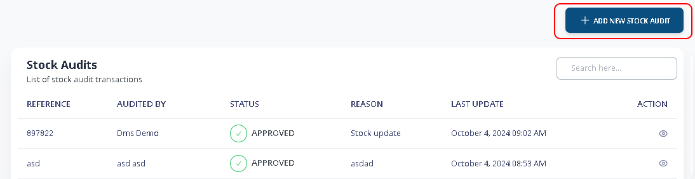
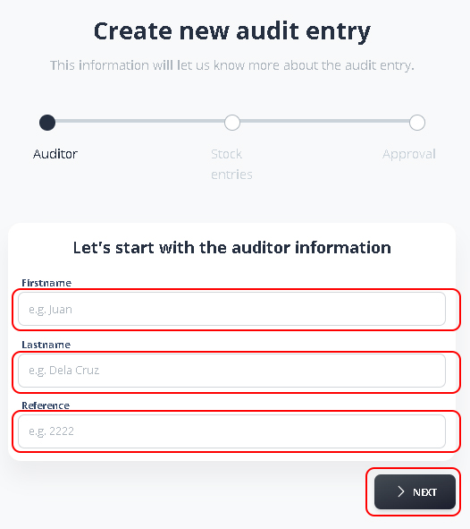
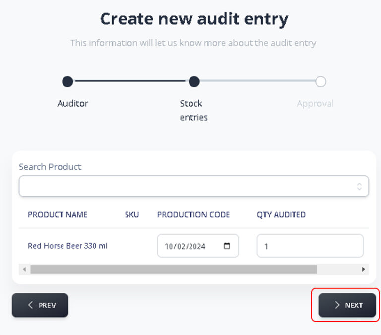
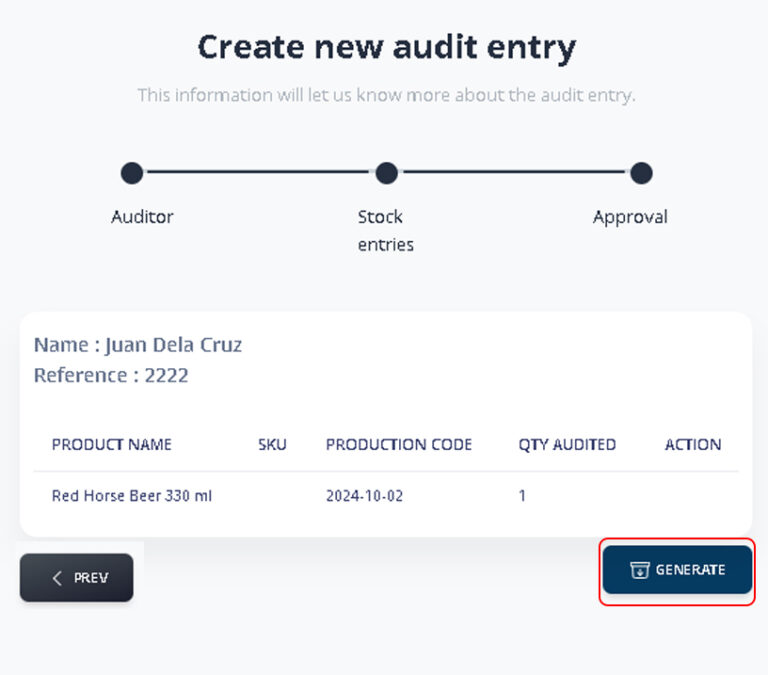
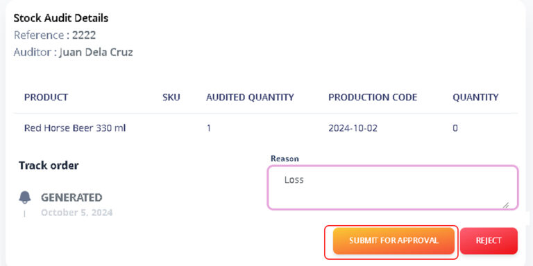
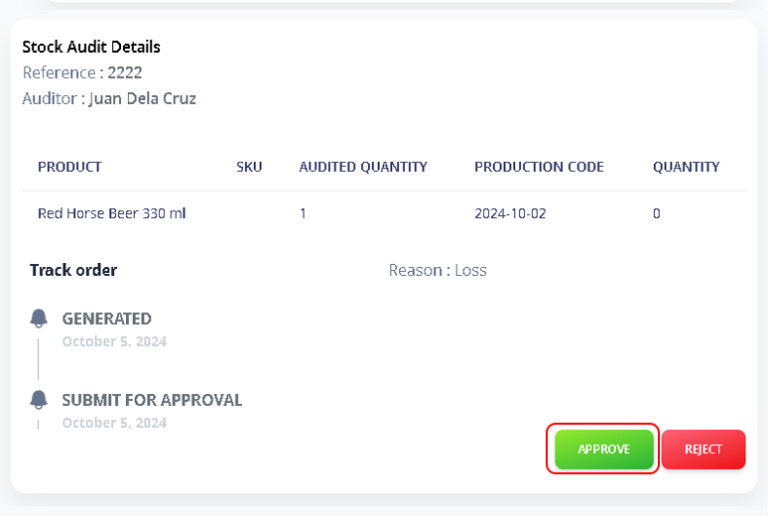

# Stock Audit

**Stock audit** is a process of verifying and validating a company’s physical inventory or stock to ensure accuracy and reliability. It involves counting and validating the quantity of goods on hand, comparing it with the records, and identifying any discrepancies

### 1. Main Menu > Inventory > Stock

Click **+ADD NEW STOCK AUDIT**

<figure><figcaption></figcaption></figure>

First you will be ask to enter the auditor’s information.

<figure><figcaption></figcaption></figure>

### 2. Create New Audit

Search for and select the product to be audited. Verify that the production date matches the product you intend to audit.


_Note: Qty Audited is the actual and existing quantity of your product._


Click **>NEXT** to continue

<figure><figcaption></figcaption></figure>

Click **GENERATE** to process the audit.

<figure><figcaption></figcaption></figure>

### 3. Submit for Approval

Make sure you indicate the Reason of the Audit, then Click **SUBMIT FOR APPROVAL**

<figure><figcaption></figcaption></figure>

You will be prompted to confirm you submission.

<figure><figcaption></figcaption></figure>

### 4. Approve Audit

Depending on you position or user permission, you might be allowed to approved the certain audit.

Search for the reference number of the audit.

You will now view the details of the audit.

<figure><figcaption></figcaption></figure>

Click **APPROVE** to confirm approval, or **REJECT** if necessary

<figure><figcaption></figcaption></figure>
