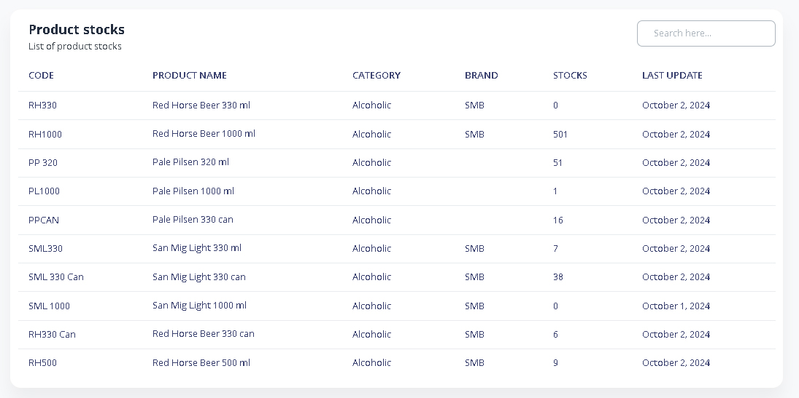
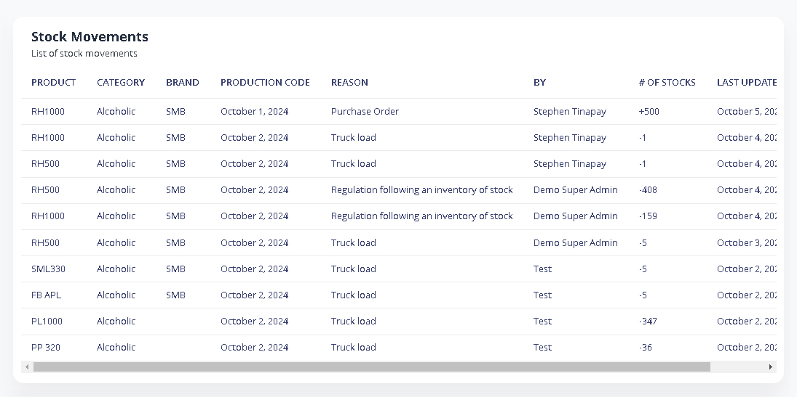

# Stocks & Movement

### 1. Product Stocks

From **Main Menu > Inventory > Stocks**

You will have an overview of your stocks and the date last update.

<figure><figcaption></figcaption></figure>

### 2. Stock Movements

From **Main Menu > Inventory > Stock Movement**

Here, you can track the movement of your products, including their locations, responsible person, and quantities.

<figure><figcaption></figcaption></figure>
