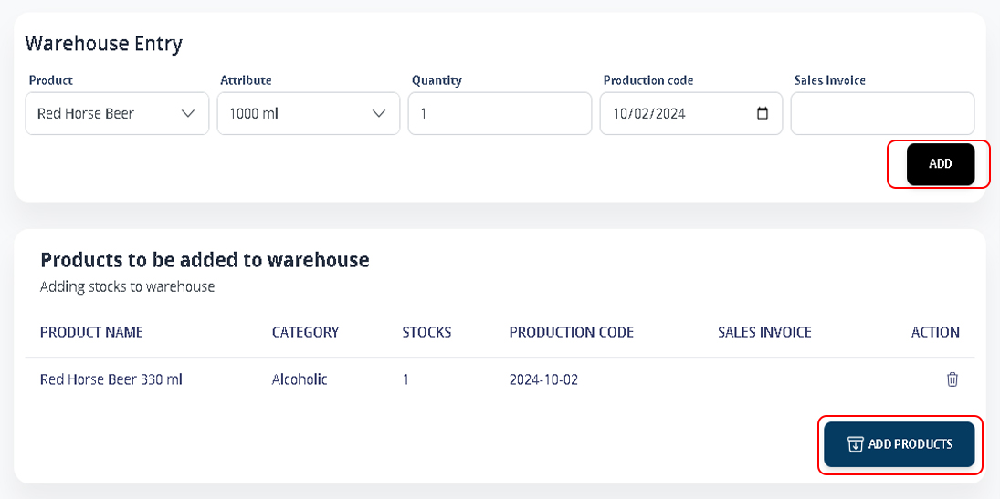

# Warehouse Entry/Aging/Assets/Merchandises

### 1. Warehouse Entry

Go to **Main Menu** > **Inventory** > **Warehouse Entry**

Input Product, Attribute, Quantity, Production Date and Sales invoice (if applicable). Click **ADD**.

Review the list added, Click **ADD PRODUCTS** to confirm.


_Note: Warehouse Entry enables you to record your current stock as your beginning inventory without requiring a Purchase Order._


<figure><figcaption></figcaption></figure>

### 2. Product Aging

Product aging is a process whereby the quality and characteristics of a beverage change over time.

Go to **Main Menu** > **Inventory** > **Aging**

The list of products will display their respective ages. Products that exceed the desired aging days will be highlighted in red for easy identification.

Click **PRINT AGING** to generate a printed version of the aging report.\

<figure><figcaption></figcaption></figure>

### 3. Add Assets

Assets are resources that your business, or organization owns or controls with the expectation that they will provide a future benefit.

Go to **Main Menu** > **Inventory** > **Assets**

Click **+MORE ASSETS** to add.

<figure><figcaption></figcaption></figure>

Fill in the Name, Price, and Initial Stock fields for your assets. Click **SAVE** to quickly add.

<figure><figcaption></figcaption></figure>

### 4. Add Merchandises

Go to **Main Menu** > **Inventory** > **Merchandises**

Click **+ADD MERCHANDISES** to add.

<figure><figcaption></figcaption></figure>

Enter the Name, Value, and Quantity information for your merchandise. Click **SAVE** to quickly add.

<figure><figcaption></figcaption></figure>
