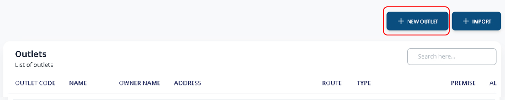
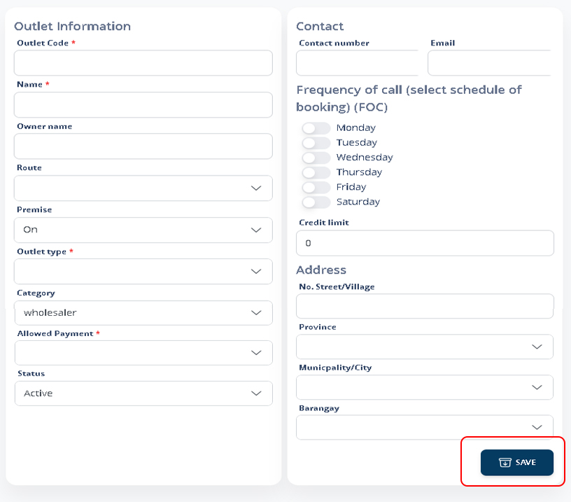

# Register New Outlet

### 1. Main Menu > Outlet Database

Click **+NEW OUTLET** Button to register new store or outlet.

<figure><figcaption></figcaption></figure>

### 2. Register New Outlet

nput all the necessary data of your outlet.

Note: Set the route number of the outlet matches with the handheld device route number. You may also register outlet in DMS App.

Press **SAVE** to complete the registration.

<figure><figcaption></figcaption></figure>
