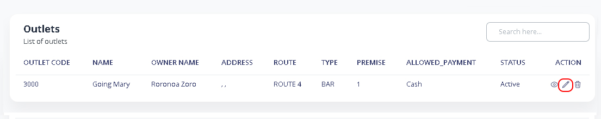
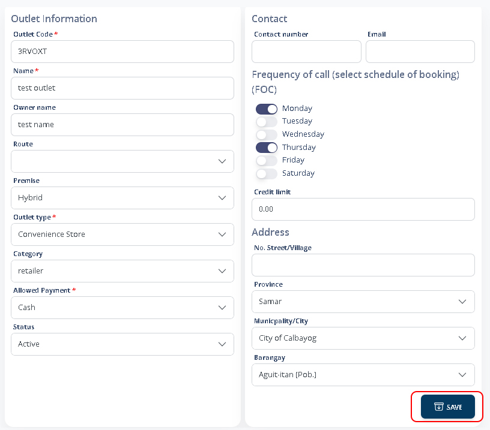

# Update Outlet

### 1. Main Menu > Outlet Database

Search for the outlet you want to update. Click the **Pencil Icon.**

<figure><figcaption></figcaption></figure>

### 2. Update Outlet

Edit or update any information you need and Click **SAVE** to update.

<figure><figcaption></figcaption></figure>
