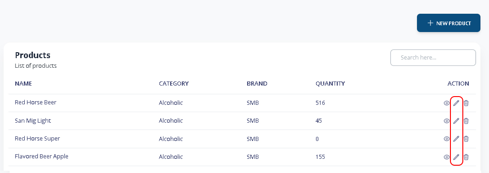
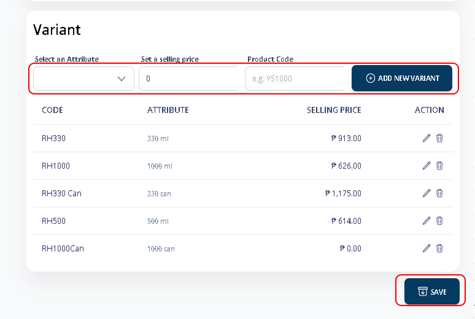

# Adding New Variant

### 1. Main Menu > Products

Select the product you want to add variant. Click the **Pencil Icon.**

<figure><figcaption></figcaption></figure>

### 2. Adding Variant

Select the attribute, Set the selling price and product code.


_Note: Selling Price (Content Amount + Full & Empties)_


<figure><figcaption></figcaption></figure>


_Illustration:_

_RH1000 Content price = 626_\
_Complete Empties price = 111_\
_Total selling price = 737_


Click **SAVE** to Add.
