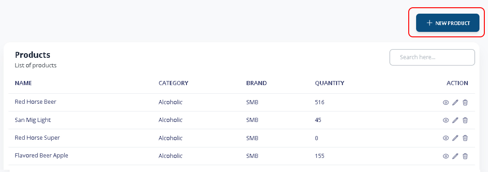
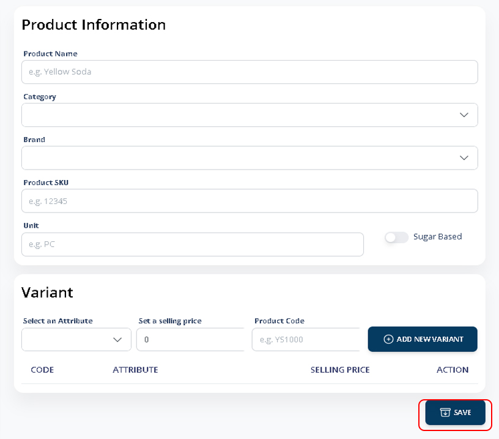

# Register New Product

### 1. Main Menu > Products

From the product list, Click **+NEW PRODUCT** to register product.

<figure><figcaption></figcaption></figure>

### 2. Register Product

Input the necessary data of your product.


_Note: Category and brand must be specified prior to adding a product. Please refer to this:_ [_Product (Attributes & Categories)_](product-attributes-and-categories.md)


Press **SAVE** to register.

<figure><figcaption></figcaption></figure>
