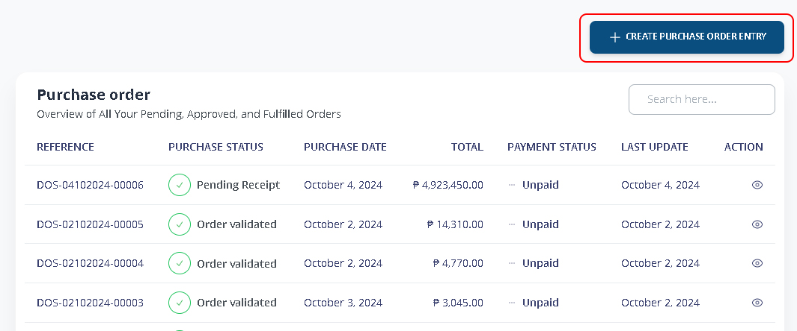
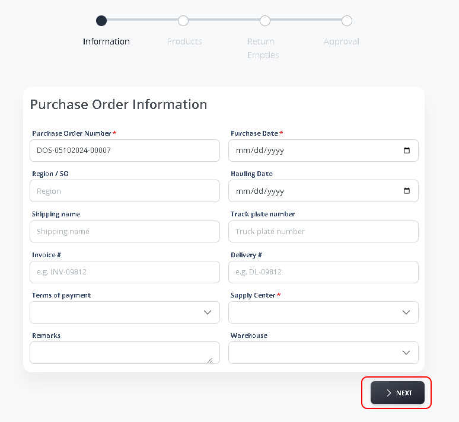
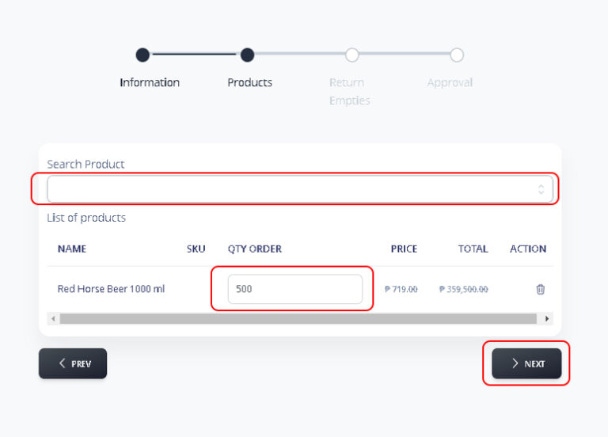
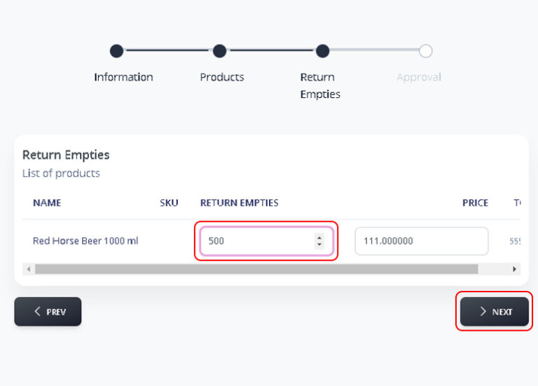
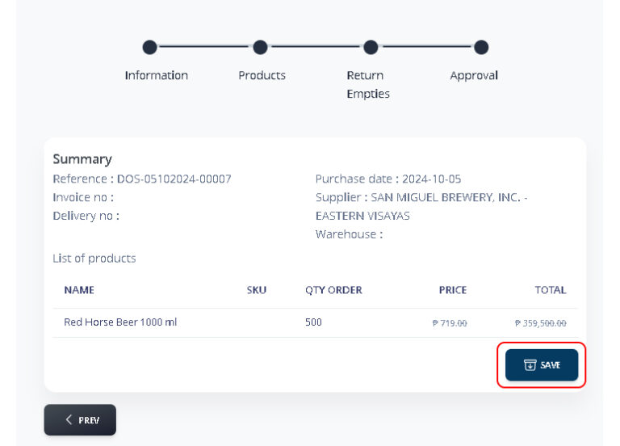
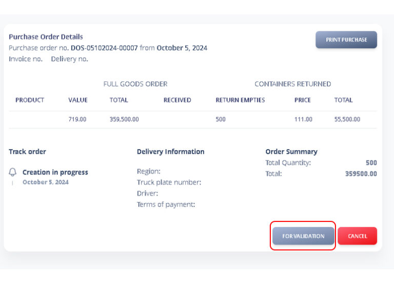
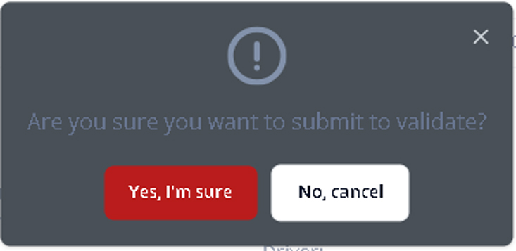
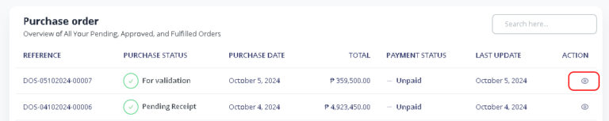
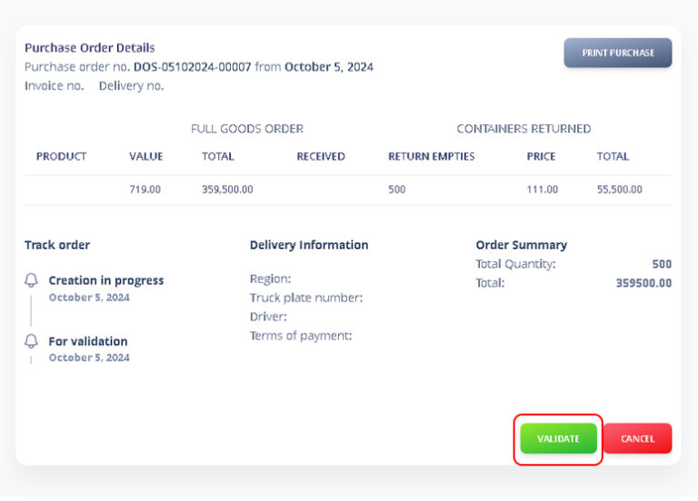
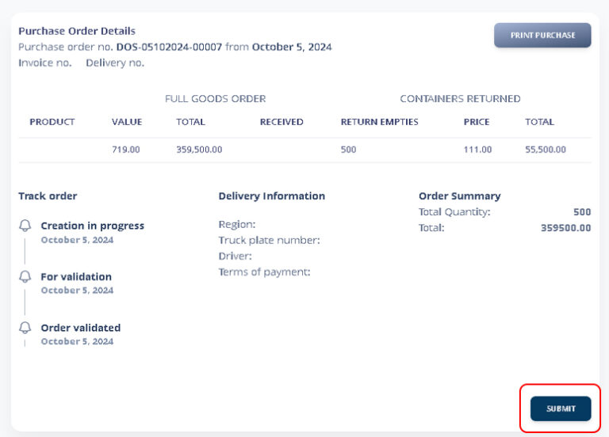

# Create Purchase Order

### 1. Purchase Order > Create Purchase Order Entry

<figure><figcaption></figcaption></figure>

### 2. Creating Purchase Order

Enter all the necessary details and information for your Purchase Order. Click **>NEXT** to continue.

<figure><figcaption></figcaption></figure>

You will now indicate all the products and quantity for purchase. Click **>NEXT** to continue

<figure><figcaption></figcaption></figure>

Next page you will enter all **Return Empties** of the specific product. Click **>NEXT** to continue

<figure><figcaption></figcaption></figure>

Review all the details then Click **SAVE**.

<figure><figcaption></figcaption></figure>

Once you’ve saved your changes, click **‘For Validation**‘ to submit them for review and approval.

<figure><figcaption></figcaption></figure>

<figure><figcaption></figcaption></figure>

### 3. Validate and Approved Purchase Order

Depending on your user role and permission. Owner, Operations Manager or any of your authorized personnel can validate and review the PO.

**Purchase Order > Action**

<figure><figcaption></figcaption></figure>

Please carefully examine the Purchase Order details. If everything is accurate, click ‘**Validate**‘ to proceed.

<figure><figcaption></figcaption></figure>

Click **Yes, I’m sure** to approve.

<figure><figcaption></figcaption></figure>

You can now Print it and Click **Submit**

<figure><figcaption></figcaption></figure>
