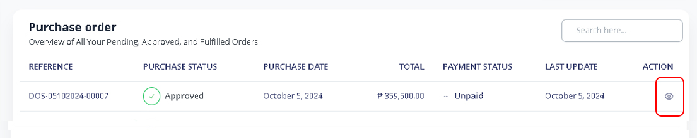
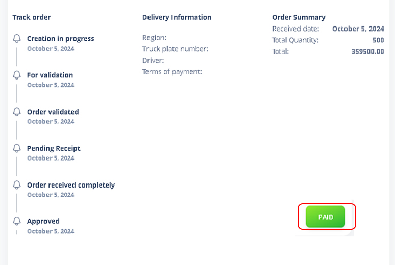

# Purchase Order Payment

### 1. Go to Purchase Order

Select PO that are already received.

Note: You cannot process with payment for a purchase oirder until it has been received.

<figure><figcaption></figcaption></figure>

### 2. Purchase Order Payment

Click ‘Paid’ button to proceed payment. The status of your purchase order will not changed to **‘Paid’**.

<figure><figcaption></figcaption></figure>
