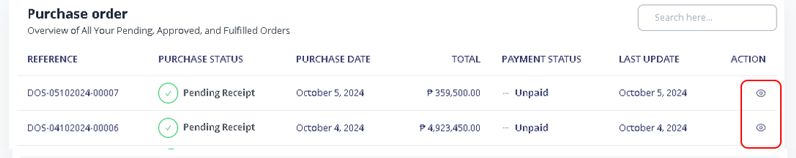
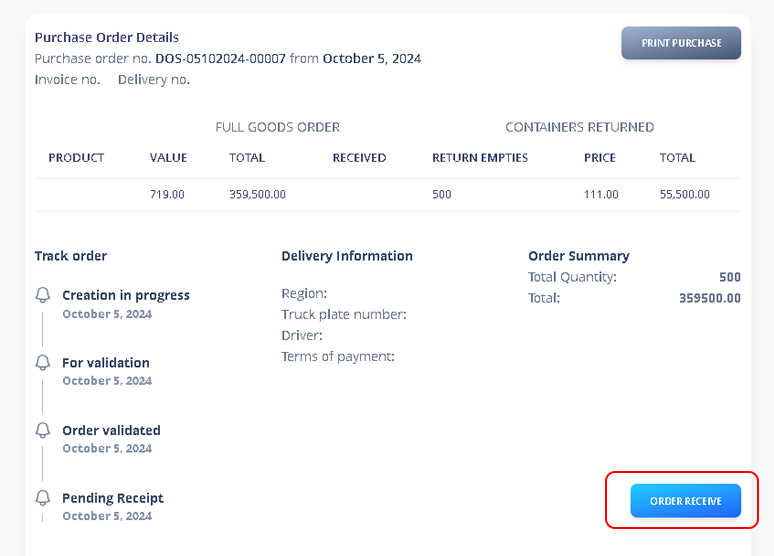
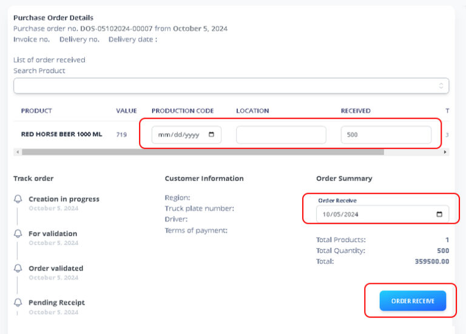
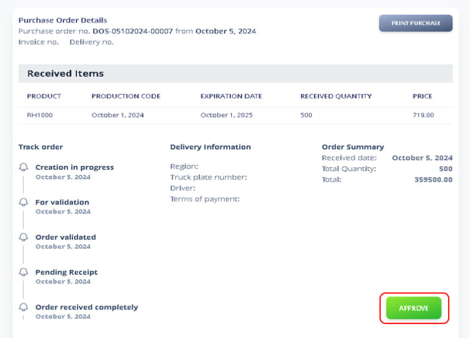

# Received Purchase Order

### 1. Go to Purchase Order

Locate the purchase order you have received by searching for it using the reference number. Click on the eye icon in the action section to view its details.

<figure><figcaption></figcaption></figure>

### 2. Order Recieved

Carefully review the purchase order details and then click on the ‘Order Receive’ button to confirm receipt.

<figure><figcaption></figcaption></figure>

### 3. Input Production Date

Once you click the ‘Order Receive’ button, you must input the following:

Production Date, Location (if applicable), Quantity Received, Date Receive

Click Order Receive again to proceed

<figure><figcaption></figcaption></figure>

### 4. Approved Order

<figure><figcaption></figcaption></figure>

After Approving, you can now print purchase order.
