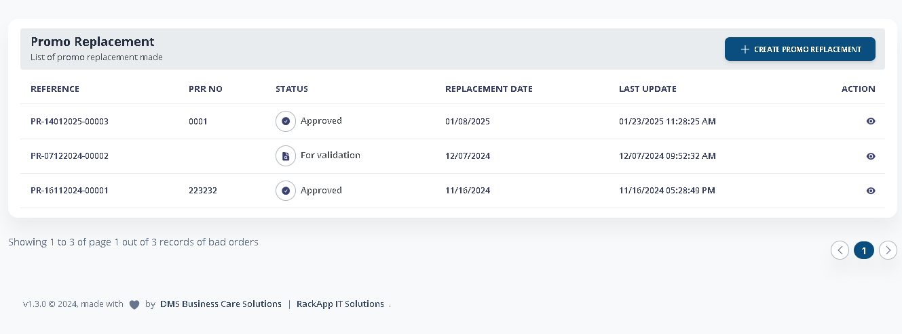

# Promo Replacement

### 1. Create Promo Replacement

Go to Reconciling Item > Promo Replacement. Click **+Create Promo Replacement.**

<figure><figcaption></figcaption></figure>

Enter the information for the promo replacement including the Replacement Date and Supply center which is required.&#x20;


_Reference code will be automatically generated by the system._


Click **Next**, this is where your search the products that were issued during promo availment of the outlet.


_Quantity of the product will be automatic based on the actual promo availment only._


<figure><figcaption></figcaption></figure>

Click **Next** and **Save.** You can now **Print Promo Replacement** and click **For Validation** to be submitted for Validatio&#x6E;**.**

<figure><figcaption></figcaption></figure>

### 2. Validate Promo Replacement


_Access to Validate are subject to your approved user role by your management._


Please navigate to the Promo Replacement page. Once there, locate the reference number you need with **"For Validation"** status, and then click the eye .png>) icon in the Action column corresponding to that number.

<figure><figcaption></figcaption></figure>

Go to the right buttom corner nad click **"Validate".** You will be prompted to enter the Promo Replacement Request Number / Invoice number.

<figure><figcaption></figcaption></figure>

To finalize Click **Submit** located at the right buttom corner.

<figure><figcaption></figcaption></figure>

### 3. Received Promo Replacement Items

Please navigate to the Promo Replacement page. Once there, locate the reference number you need with **"Pending Receipt"** status, and then click the eye .png>) icon in the Action column corresponding to that number.

<figure><figcaption></figcaption></figure>

Click **Promo Replacement Receive**

<figure><figcaption></figcaption></figure>

Enter the following information including the quantity & date received, production code. Then Click **Promo Replacement Receive** button.

<figure><figcaption></figcaption></figure>

If your role permits, click "**Approved**" to approve the received items.
