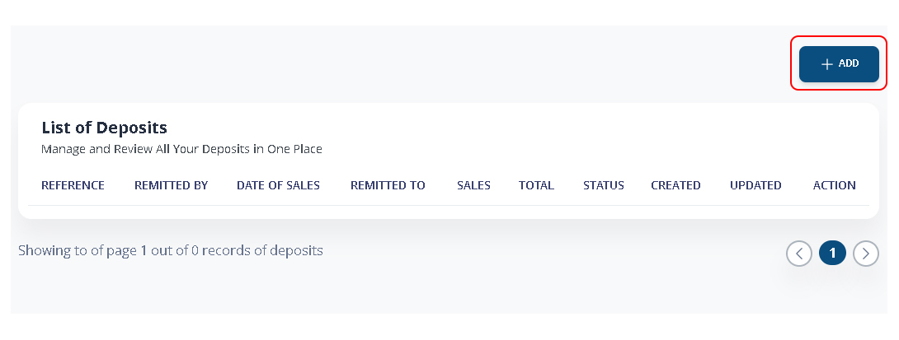
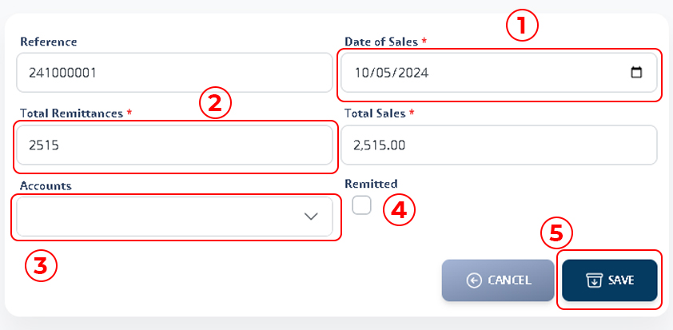
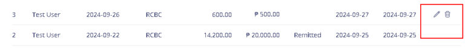

# Deposit

### 1. Go to Deposits List

See all deposited records and status. Click **+ADD** to register a deposits.

<figure><figcaption></figcaption></figure>

### 2. Register New Deposits

1. **Date of Sales.** Select Date of sales you want to deposits. Total Sales will be automatically display based on the sales amount of the date selected.
2. **Total Remittances.** Enter the amount of your remittances.
3. **Accounts.** Select the account where you want to deposit (e.g Bank).
4. Tick on the box if it is already remitted.
5. Click on **SAVE** to proceed.

<figure><figcaption></figcaption></figure>

### 3. Update Deposit

You can still update the deposit you register, however it is only possible to those deposit that are still not remitted.

**Go to List of Deposits > Action > Update icon** _(pencil icon)_

<figure><figcaption></figcaption></figure>

Deposits that have been marked as ‘Remitted’ will not display the update or delete icons, indicating that they cannot be modified or removed.
