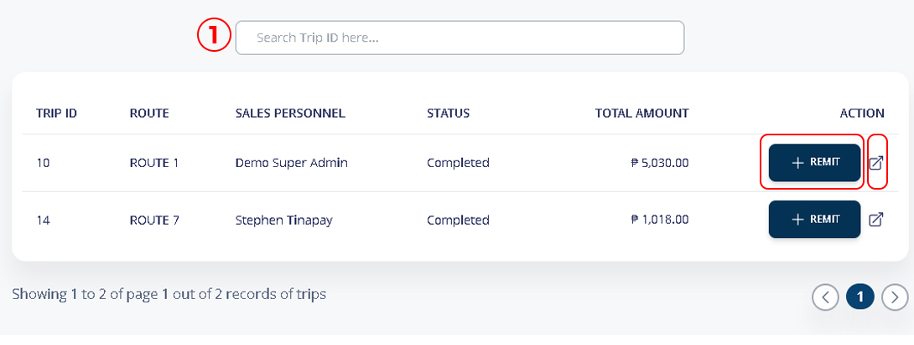
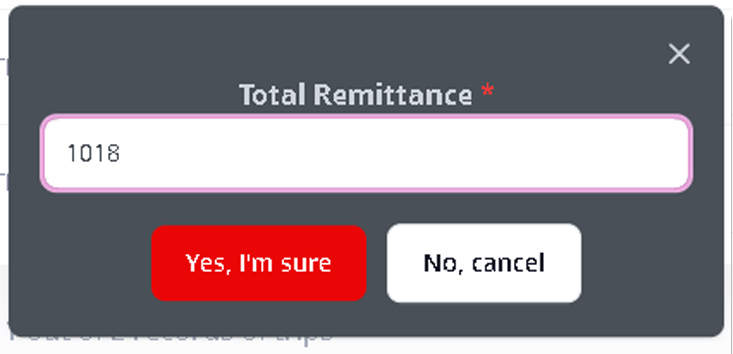
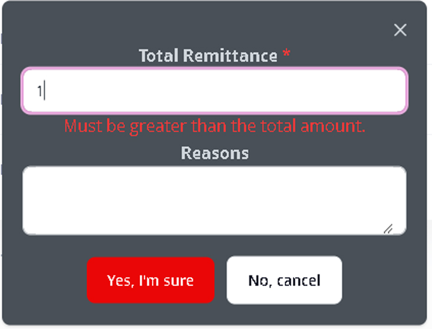

# Remittance Process

The Cashier page is designed for users with the “cashier” role. It allows them to manage remittance transactions from personnel who have completed their designated routes. When personnel finish their routes, they need to visit the cashier to remit the funds collected during their trip.

The cashier is responsible for verifying and processing these remittances. This page provides features for tracking, managing, and searching remittances, ensuring accountability and streamlined cash management within the business.



The **Cashier** page is only accessible to users who are assigned the **cashier** role. This role grants them specific permissions related to the remittance process:

* **Cashier Role**: Responsible for receiving remittances from personnel and managing cash-related tasks for completed routes.
* **Personnel Role**: Responsible for remitting collected funds to the cashier once they complete their assigned routes.



The remittance process begins when personnel complete their trip. The process is as follows:

* **Complete Route:** Once a personnel finishes their assigned route, they are required to remit the funds collected during their trip.
* **Visit Cashier:** Personnel will go to the cashier to remit their funds. This step ensures that all cash and transaction data are accounted for at the end of the route.
* **Cashier Confirmation:** The cashier will review the remittance, ensure the details are accurate, and confirm the remittance.
* **Logging the Remittance:** The cashier will log the transaction details in the system, including the total amount remitted and other relevant information.



### 1. Main Menu > Cashier

1. Search for the Trip ID of specific Route/Trip.
2. Cashier have the option to view and print the details or might proceed to **+REMIT** immediately.

<figure><figcaption></figcaption></figure>

### 2. Click Remit

The amount will reflect based on the agent remitted on the handheld device DMS App.

<figure><figcaption></figcaption></figure>

### 3. **Must be greater than the total amount error.**

If the amount remitted by the agent is lower than the total amount, you’ll see an error message. Please provide a detailed explanation for the discrepancy.\

<figure><figcaption></figcaption></figure>

then Cllick **Yes, I’m Sure** to proccess remittance

After Remitted successfully, the status of the trip will be changed to _**Remitted**_.&#x20;
