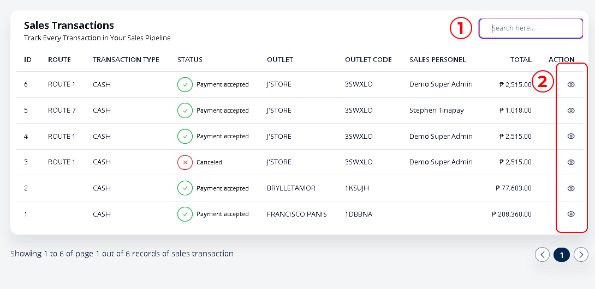
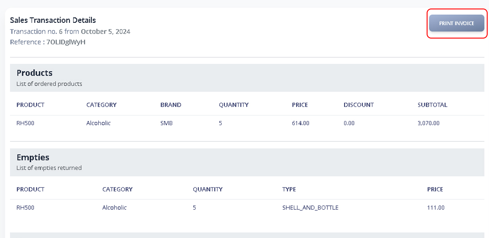
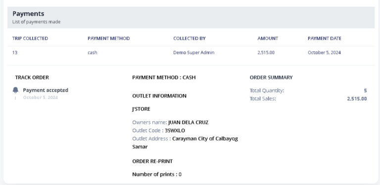

# Sales Transactions

### 1. **Main Menu > Sales Transactions**

You will view the sales transaction made in different route, outlet and it’s status.

1. Search for outlets to filter results.
2. Clicking the eye icon will display a detailed view of the transaction

<figure><figcaption></figcaption></figure>

### 2. **Sales Transaction Detailed View**&#x20;

<figure><figcaption>
Page Upper Portion
</figcaption></figure>

<figure><figcaption>
Page Lower Portion
</figcaption></figure>
