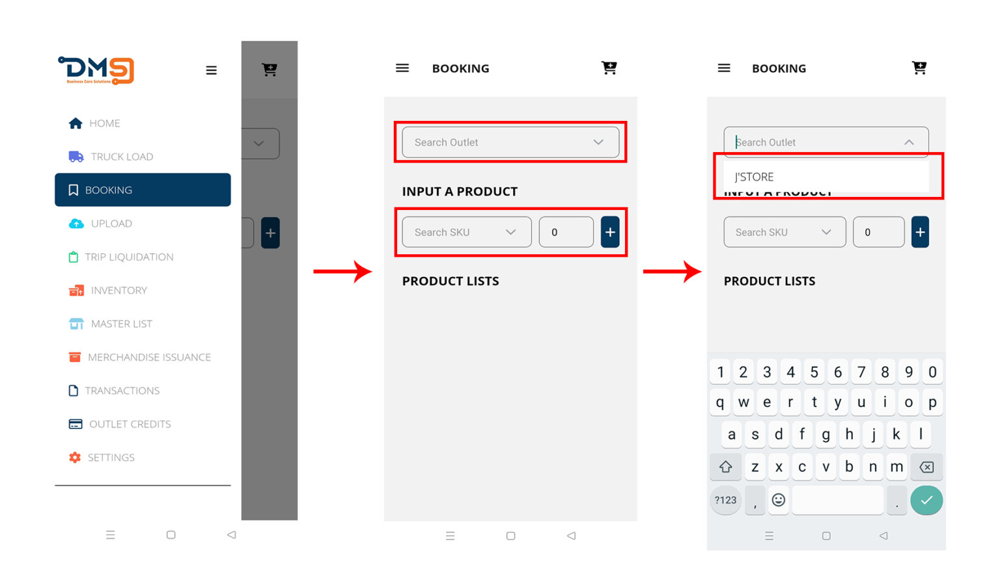
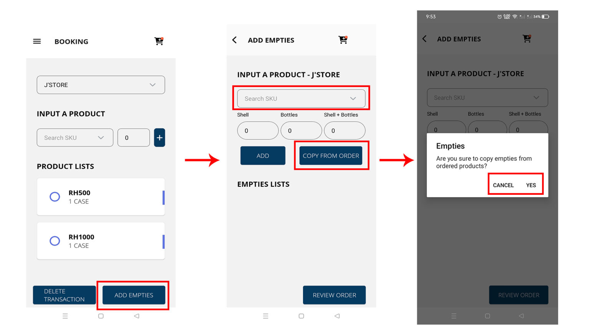
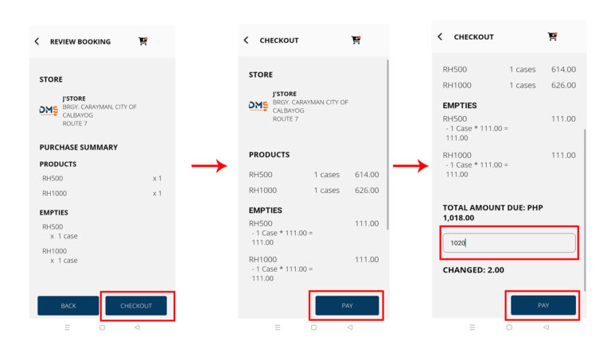
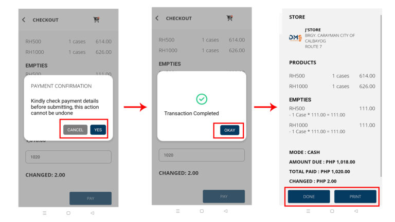

# Outlet Booking

### 1. **Main Menu ☰ > BOOKING**

Select the outlet/store to be booked.


_Note: The app will only show outlets that are assigned to the same delivery route number as the device you’re using._


<figure><figcaption></figcaption></figure>

### 2. **Booking Product**

* &#x20;Select all products ordered by the outlet
* **Add Empties**. You can manually enter the number of empty containers by full empties, bottle or shell only, or you can quickly copy the quantity from the order if all items have the same equivalent unit by clicking **COPY FROM ORDER**.


Note: Your current stock levels are directly influenced by the products you loaded onto the trucks during the loading process and not the stock in your warehouse. _Please refer on this:_ [_Truck Load_](truck-load.md)


<figure><figcaption></figcaption></figure>

### 3. **Checkout Order**

During this process, you may review orders and proceed to checkout.

<figure><figcaption></figcaption></figure>

Scroll down to enter the total amount paid and proceed to payment.

### 4. Pay Order

Before confirming payment, please carefully review all order and payment details. Once confirmed, the transaction cannot be reversed.

<figure><figcaption></figcaption></figure>

After confirming, your transaction are now completed, You may now print the sales invoice, it will print in two(2) copies (Merchant Copy, Customer Copy).

Press **DONE** to transaction another booking.
