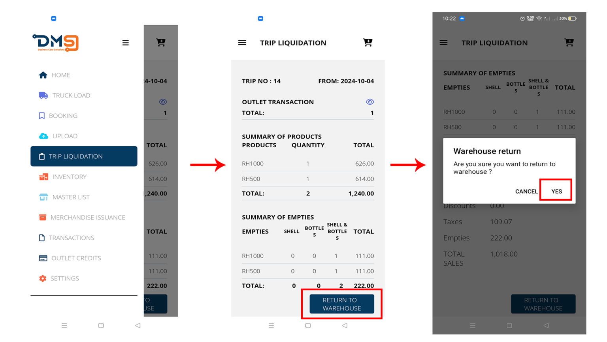
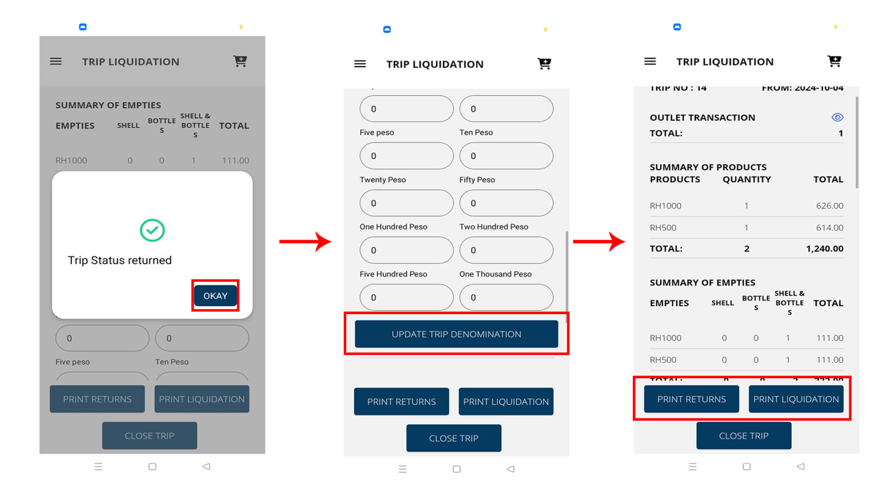
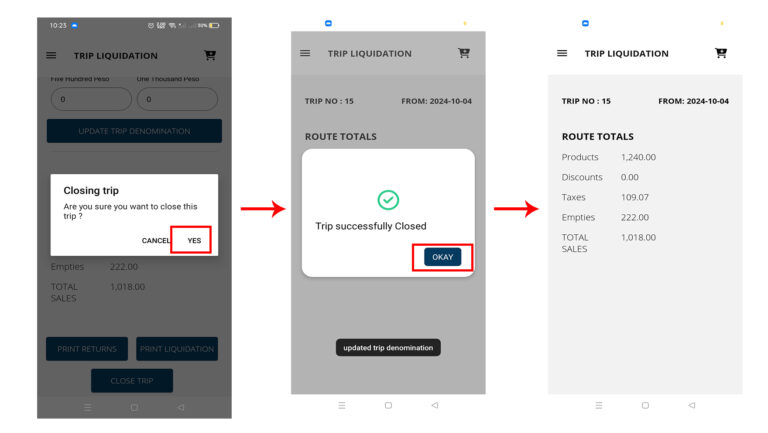

# Trip Liquidation

### 1. **Menu ☰ > Trip Liquidation**

The page will display the Summary of all you transactions.

Click **Return to Warehouse** if your ready to settle your trip.

<figure><figcaption></figcaption></figure>

### 2. **Update Money Denomination**

it is necessary to update your cash breakdown. Scroll down you will find the denomination, input and Click **Update Denomination**.

<figure><figcaption></figcaption></figure>

After updating your cash breakdown. You may now Print Returns and Liquidation.

### **3. Closing Trip**

Closing the trip signifies its completion. This involves turning in all cash, invoices, and related paperwork.

Before closing the trip, you’ll be prompted for confirmation. Once closed, the system will automatically generate a new trip ID for any subsequent trips on the same day or route.

<figure><figcaption></figcaption></figure>
