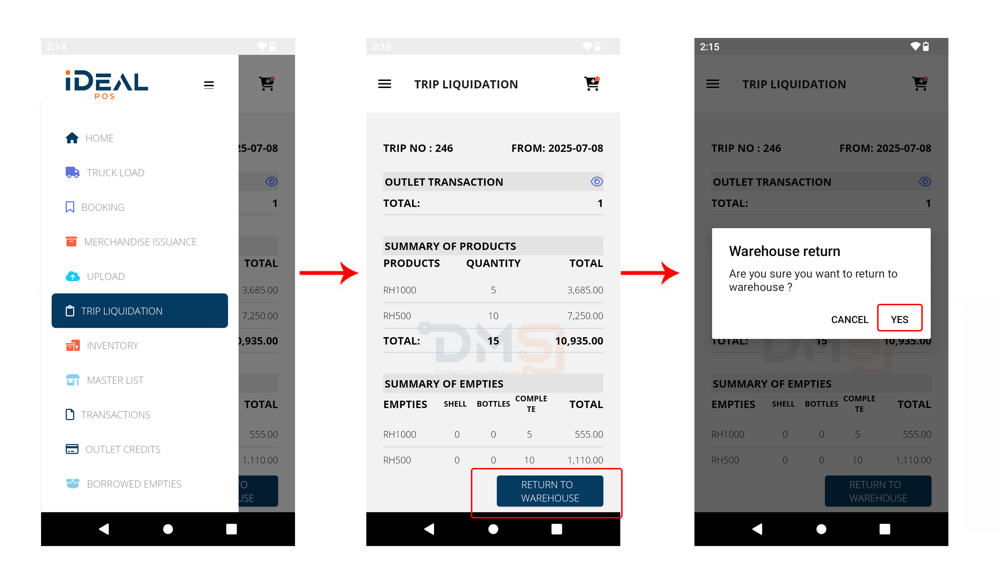
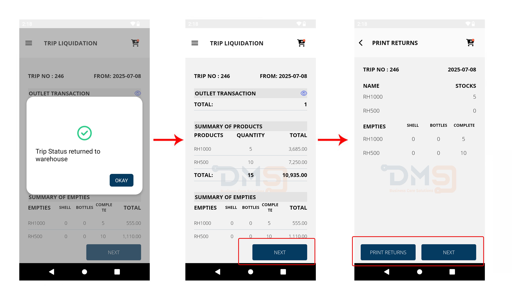
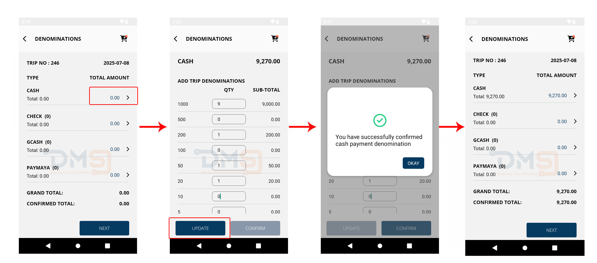
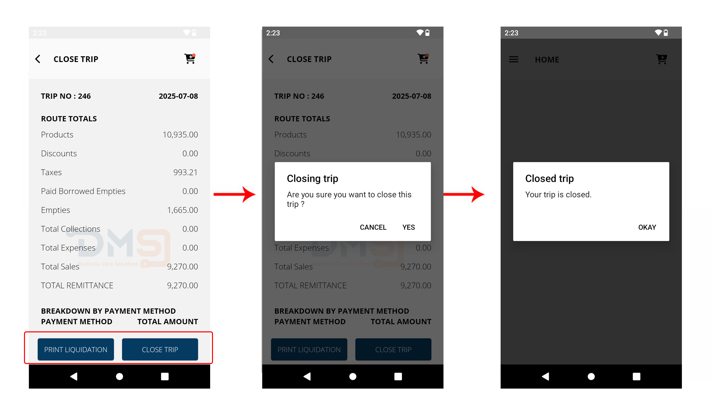

# Trip Liquidation


_Before you start this process, please make sure that all transactions have been successfully uploaded to the server._


### 1. **Menu ☰ > Trip Liquidation**

The page will display the Summary of all you transactions.

Click **Return to Warehouse** if your ready to settle your trip.

<figure><figcaption></figcaption></figure>

<figure><figcaption></figcaption></figure>

When you see the **"Trip Status returned to warehouse"** prompt, your trip liquidation summary will appear. After reviewing it, click **NEXT**. The system will then display the return items. Make sure you print these returns before proceeding to the next step.

### 2. **Update Money Denomination**

You'll need to update your cash breakdown. If you have transactions with multiple payment methods, they'll be shown on the denomination page. To update your cash, select **Cash**. You'll then see "Add Trip Denomination," where you can enter the quantity for each denomination. Once you're sure the cash breakdown is exact, click **Update** to finalize it.

<figure><figcaption></figcaption></figure>

### **3. Closing Trip**

Closing the trip signifies its completion. This involves turning in all cash, invoices, and related paperwork.

Before closing the trip, you’ll be prompted for confirmation. Once closed, the system will automatically generate a new trip ID for any subsequent trips on the same day or route.

<figure><figcaption></figcaption></figure>
