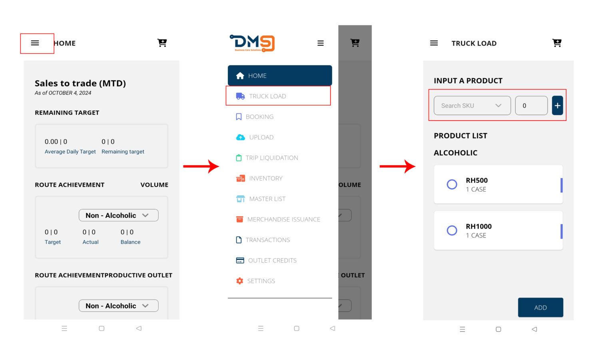
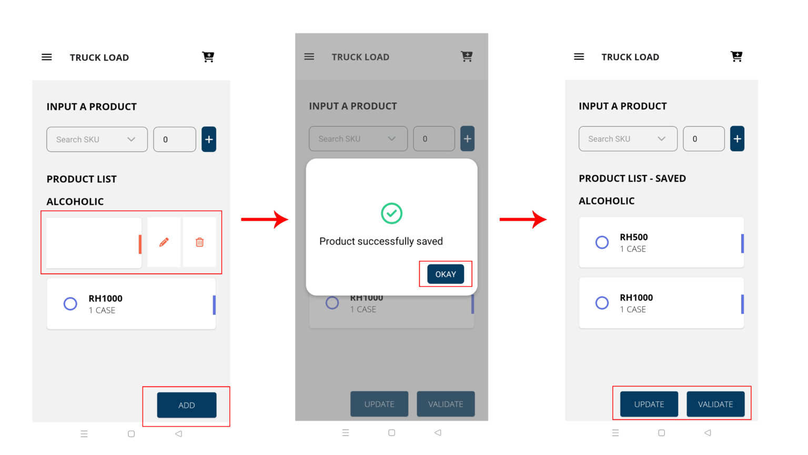
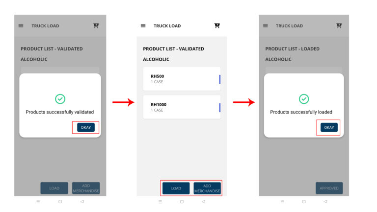
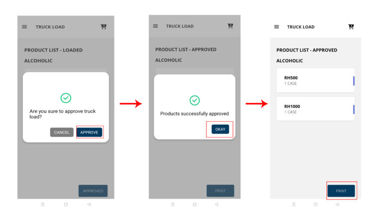

# Truck Load


_**Important:** Please check your available stock and price list on the system before performing truckload._


### 1. **Menu ☰ > Truck Load**

Search for the product nad input the quantity, click the Plus(**+)** button to add to the list.

<figure><figcaption></figcaption></figure>

You may edit or delete the product in the list by _Slidng to Left_. Having the final listing of the product Click **Add** to saved.

<figure><figcaption></figcaption></figure>

After successfully saving the products, you have the option to modify or validate the saved list.

## 2. Load the Product

The validated products are ready to load. Add more merchandise if needed, then press **Load**.

<figure><figcaption></figcaption></figure>

## 3. Approved Truck load

Once you’ve approved the products for the trip, press ‘Print’ to generate a list of all items loaded. Provide this printed copy to your designated warehouse representative or operations manager.

<figure><figcaption></figcaption></figure>

