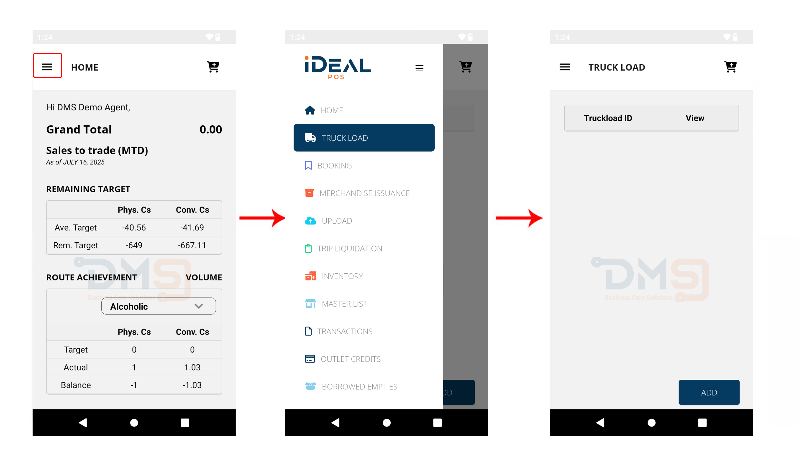
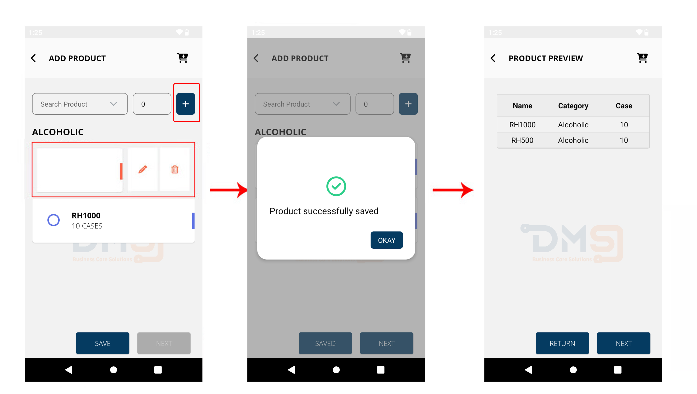
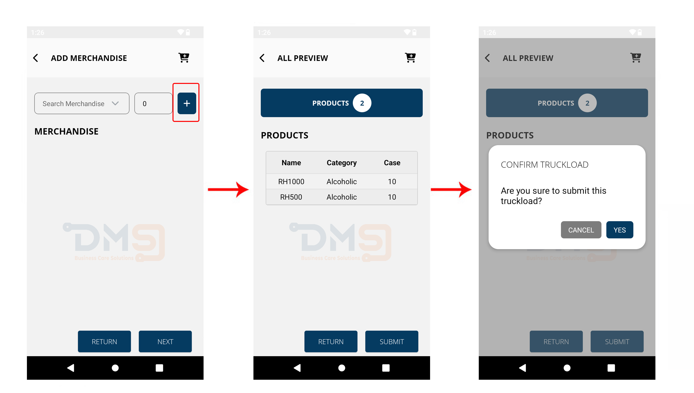

# Truck Load


_**Important:** Please check your available stock and price list on the system before performing truckload._


### 1. **Menu ☰ > Truck Load**

You may add multiple truckloads in one trip. This can be achieve by clicking "Add" button.

<figure><figcaption></figcaption></figure>

Search for the product nad input the quantity, click the Plus(**+)** button to add to the list and click **SAVE**.

You may edit or delete the product in the list by _Slidng to Left_. Preview of the product will show then **NEXT** to continue.

<figure><figcaption></figcaption></figure>

After successfully saving the products, you have the option to Add Merchandise and click Next to proceed. After reviewing all items loaded click **SUBMIT** to finish.

<figure><figcaption></figcaption></figure>

Truckload submitted successfully! You can now print or return to the Truckload page to add another load.

