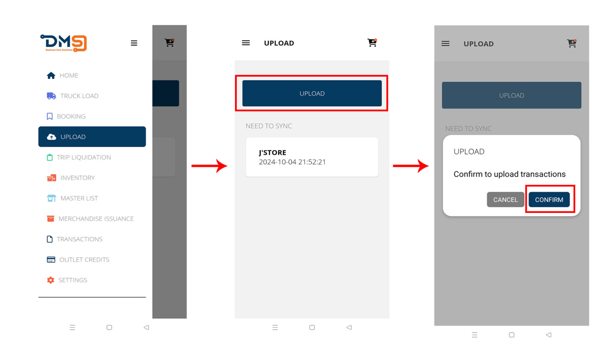
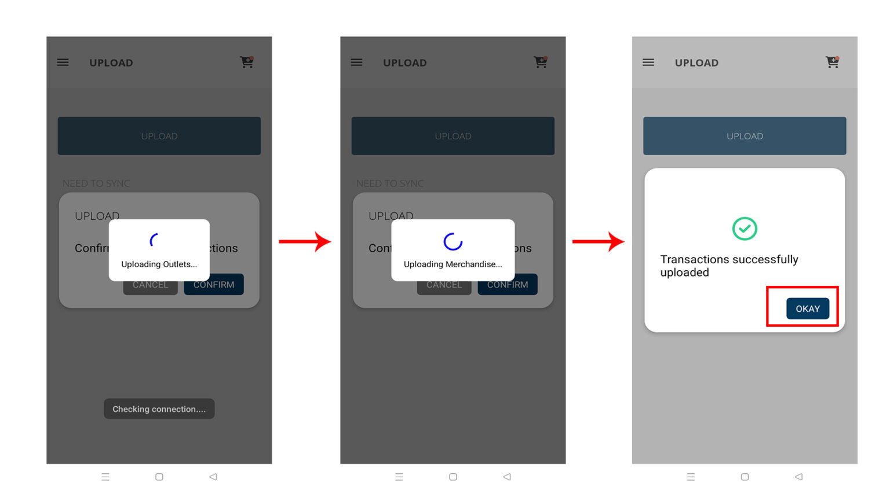

# Upload Transactions

### 1. Upload Transactions

This page displays a complete record of all transactions. To synchronize this data with the central server, simply press ‘Upload.


_Note: You need an internet connection to be able to proceed to uploading._


<figure><figcaption></figcaption></figure>

Once you’ve confirmed, please keep the app open while the upload process is in progress. Do not close the app until you see the ‘Transaction Successfully Uploaded’ message.

<figure><figcaption></figcaption></figure>
