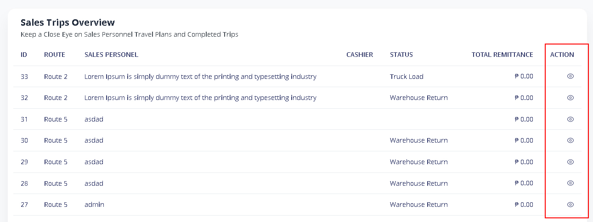
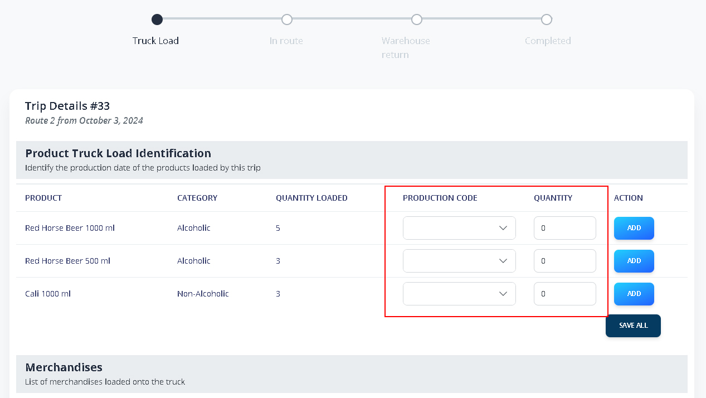
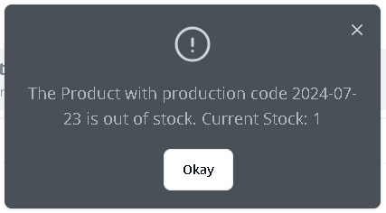
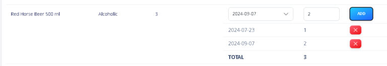
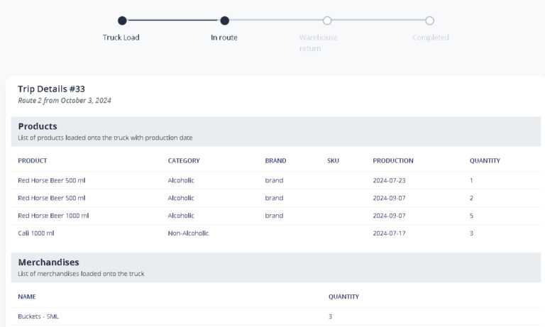

# Processing Trips


_The truck load will be processed on the iDeal POS App or DMS Handheld device by the agent. Please refer in this_ [_Truck Load Process_](ideal-pos/truck-load.md)


### 1. Trip > Find the Trip ID&#x20;

<figure><figcaption></figcaption></figure>

### &#x20;2.  **Indicate the&#x20;**_**Production Date**_**&#x20;with its corresponding&#x20;**_**Quantity**_


_De&#x70;_&#x65;_nding on your operations usually Production date will be provided by your warehouse in-charge or checker._


<figure><figcaption></figcaption></figure>


_Scrolling down to view all the Merchandise loaded and other details of the trip._


**3. Click ADD to confirm. SAVE ALL to proceed**

**4. An error will occur if the product’s stock is insufficient for the designated production date.**

<figure><figcaption></figcaption></figure>

**5. Please add a new production date and specify the desired quantity.**

<figure><figcaption>
Multiple Production Date
</figcaption></figure>

**6. The trip status will remain ‘En Route’ until the agent returns to the warehouse, at which point it will be updated.**

<figure><figcaption></figcaption></figure>
