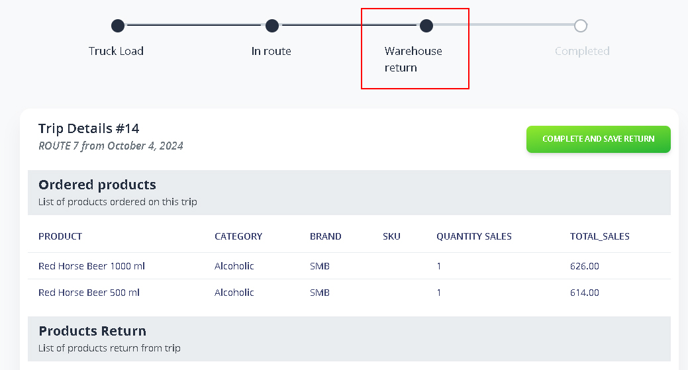
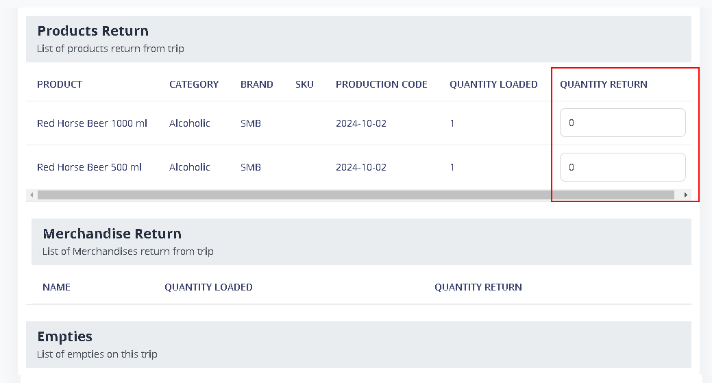
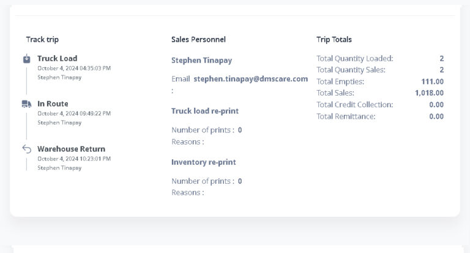
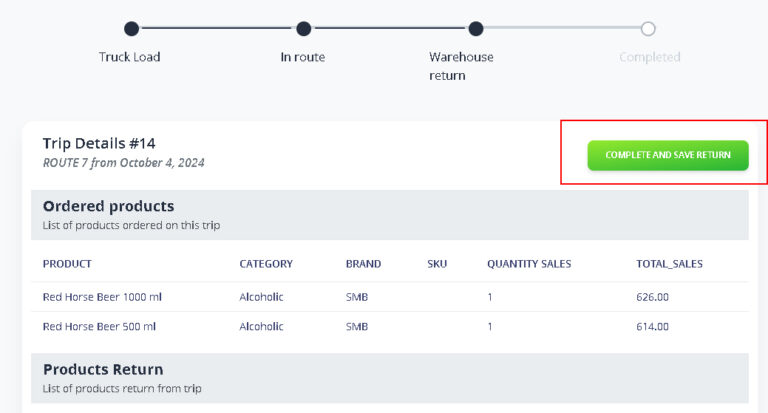
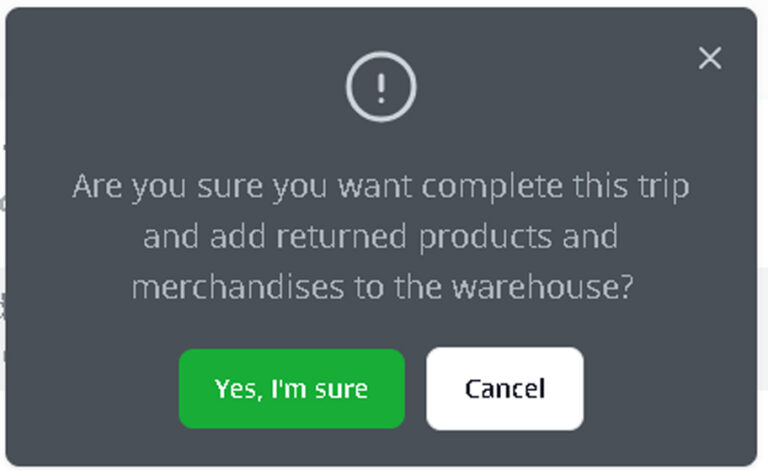
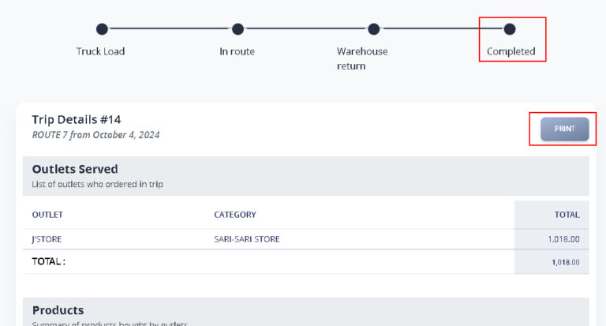

# Return to Warehouse

### 1. Go to Trips Menu

<figure><figcaption></figcaption></figure>

Inside the Trips page, you will observe that from EN ROUTE status it will be redirect to WAREHOUSE RETURN.


_Note: Warehouse Return will be initiate by your agent using their handheld device. Please refer to this:_ [_Trip Liquidation_](ideal-pos/trip-liquidation.md)


### 2. Input any Quantity Return&#x20;

Scroll down to the Product & Merchandise Return section on the Trips Status page. Any items that your agent returns to the warehouse will be verified and recorded here.

<figure><figcaption></figcaption></figure>


_Note: Nothing to be change if none of the loaded product returned._


### 3. View Trip Details

<figure><figcaption></figcaption></figure>

### 4. Complete and Save Return

After you review the trip, return to the top and click the COMPLETE AND SAVE RETRUN button to proceed.

<figure><figcaption></figcaption></figure>


_A prompt will appear asking you to confirm. Click ‘Yes, I’m sure’ to proceed, or ‘Cancel’ to review the details before continuing._


<figure><figcaption></figcaption></figure>

After confirming, that specific trip is now completed. You may print the trip liquidation for your reference,

<figure><figcaption></figcaption></figure>
